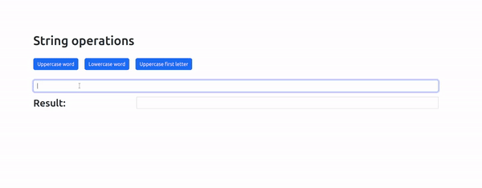

# Word-Formater-App

## Exercise Course-Module 3 - Intro Single Page Application (SPA) - HTML/CSS/JavaScript

created at 06.02.23;

For practicing JavaScript modules I wrote an app that allows to format a string by using/import a module (`stringhelper.js`) and created 3 functions in it to:

- uppercase a word from input field
- lowercase a word from input field
- capitalize first letter of the word from input field.

(To use the app run the `index.html` using Live Server.)

### My Version:

